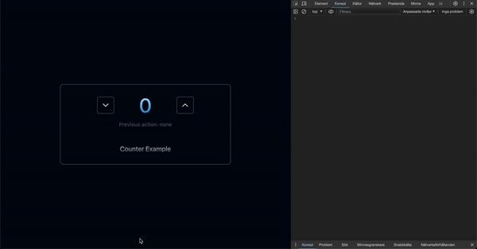

# Phaseshift

A barebones proof of concept Typescript web framework that allows interactive user interfaces with real time state on the server via Websockets. Client can call functions in real time on the server and HTML is updated and sent in patches, only when needed. Inspired by the concept of Websocket updates from the Elixir Phoenix framework and Liveview.

